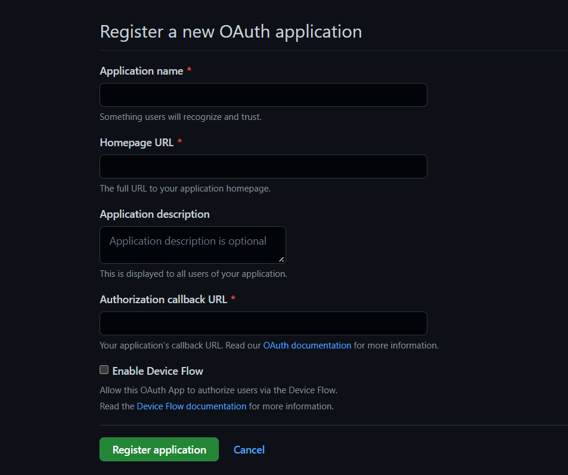
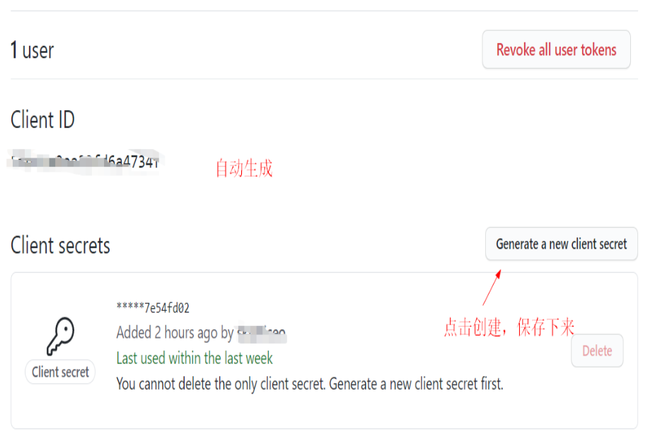

拉取镜像
```
docker pull hanhongyong/ms365-e5-renew-x:latest
```

部署容器
```
docker run -d -p 1066:1066 -e TZ=Asia/Shanghai --name ms365  hanhongyong/ms365-e5-renew-x:latest
```
映射目录
```
docker run -d -p 1066:1066 -v /root/Docker_Microsoft365_E5_Renew_X/Microsoft365_E5_Renew_X/Deploy:/app/Deploy  hanhongyong/ms365-e5-renew-x:latest
```

迁移备份命令
```
docker run -d -p 1066:1066 -v /root/Docker_Microsoft365_E5_Renew_X/Microsoft365_E5_Renew_X/:/app/ hanhongyong/ms365-e5-renew-x:latest
```
反向代理
使用宝塔
不详细赘述，自行查看。

修改 nginx 文件
nginx 配置文件修改模板：

```
location ~ / {
        proxy_set_header X-Forwarded-For $proxy_add_x_forwarded_for;
        proxy_set_header Host $http_host;
        proxy_redirect off;
        proxy_pass https://127.0.0.1:1066;
}
```


修改配置
```
Config.xml 文件默认配置
<?xml version="1.0" encoding="utf-8" ?>
<Configuration>
    <!--站点服务器基本配置-->
    <Serivce>
        <!--服务访问端口-->
        <Port>1066</Port>
        <!--管理员密码(管理员登录路由/Admin/Login) 重要：首次启动前必须更改-->
        <LoginPassword>12345678</LoginPassword>
        <!--是否启用内核多线程支持-->
        <CoreMultiThread>true</CoreMultiThread>
        <!--网站备案（选填）-->
        <ICP>
            <!--备案显示文本-->
            <Text></Text>
            <!--备案管理查询机构跳转链接-->
            <Link>https://beian.miit.gov.cn</Link>
        </ICP>
        <!--Bootstrap CDN 若要更改请务必使用bootstrap@5.1.3版本（选填）-->
        <CDN>
            <!--Bootstrap CSS文件CDN bootstrap.min.css-->
            <CSS>https://cdn.staticfile.org/bootstrap/5.1.3/css/bootstrap.min.css</CSS>
            <!--Bootstrap JS文件CDN bootstrap.bundle.min.js-->
            <JS>https://cdn.staticfile.org/bootstrap/5.1.3/js/bootstrap.bundle.min.js</JS>
        </CDN>
    </Serivce>
    <!--站点Kestrel服务器HTTPS配置 （只支持IIS证书类型 即PFX格式的证书）-->
    <HTTPS>
        <!--Kestrel是否启用HTTPS(SSL加密传输)-->
        <Enable>false</Enable>
        <!--SSL证书文件名 (需要将PFX格式的SSL证书放置于该配置文件的同级目录Deploy文件夹下) 如e5.sundayrx.net.pfx-->
        <!--不填则默认使用Dev localhost 本地证书-->
        <Certificate></Certificate>
        <!--SSL证书密钥(PFX证书的访问密钥)-->
        <Password></Password>
    </HTTPS>
    <!--共享站点配置,不共享可无视以下内容 (若要共享站点 请自备以下所需的配置信息 且配置中HTTPS必须启用)-->
    <ShareSite>
        <!--是否启用站点共享-->
        <Enable>false</Enable>
        <!--SMTP邮件发送支持-->
        <SMTP>
            <!--发件邮箱-->
            <Email></Email>
            <!--邮箱密钥-->
            <Password></Password>
            <!--SMTP服务器地址-->
            <Host></Host>
            <!--SMTP服务器端口-->
            <Port>587</Port>
            <!--SMTP服务器是否使用SSL传输-->
            <EnableSSL>true</EnableSSL>
        </SMTP>
        <!--第三方OAuth登录支持(至少启用以下一种OAuth否则其他用户无法注册)-->
        <OAuth>
            <!--微软登录授权-->
            <Microsoft>
                <!--是否启用该OAuth-->
                <Enable>true</Enable>
                <!--应用程序Id-->
                <ClientId></ClientId>
                <!--应用程序访问机密-->
                <ClientSecret></ClientSecret>
            </Microsoft>
            <!--GitHub登录授权-->
            <Github>
                <!--是否启用该OAuth-->
                <Enable>true</Enable>
                <!--应用程序Id-->
                <ClientId></ClientId>
                <!--应用程序访问机密-->
                <ClientSecret></ClientSecret>
            </Github>
        </OAuth>
        <!--站点系统设置-->
        <System>
            <!--站点启动后默认是否允许用户注册 建议为false-->
            <AllowRegister>false</AllowRegister>
            <!--站点启动后默认公告（换行符请使用 &#x000D;&#x000A; 进行换行）-->
            <Notice></Notice>
            <!--站点运营者-->
            <Master></Master>
            <!--站点运营者推广链接-->
            <MasterLink></MasterLink>
            <!--站点新用户默认配额数-->
            <DefaultQuota>1</DefaultQuota>
            <!--站点自动特赦时间间隔 （单位：天 至少30天）-->
            <AutoSpecialPardonInterval>30</AutoSpecialPardonInterval>
        </System>
    </ShareSite>
</Configuration>
```
修改默认密码
```
    <!--管理员密码(管理员登录路由/Admin/Login) 重要：首次启动前必须更改-->
    <LoginPassword>12345678</LoginPassword>
```
端口也可以修改，但是同时需要修改部署操作中的对应端口。


开放站点
如果该站点仅个人使用，此步骤可以省略。
```
打开开放站点配置
    <!--是否启用站点共享-->
    <Enable>false</Enable>
false 修改为 true
```
配置 ssl 证书
开放站点必须使用全链路 HTTPS，即便是使用了 Nginx 反向代理也必须设置 HTTPS 为启用状态。

以下有两种方式均可。
```
openssl
openssl req -newkey rsa:2048 -nodes -keyout 0.key -x509 -days 365 -out youfilename.cer
 ```
 ```
openssl pkcs12 -export -in youfilename.cer -inkey 0.key -out youfilename.pfx
在 Deploy 文件夹中运行该命令，即与 Config.xml 文件相同文件夹。
```

修改 Config.xml 文件：
```
<HTTPS>
        <!--Kestrel是否启用HTTPS(SSL加密传输)-->
        <Enable>false</Enable>
        <!--SSL证书文件名 (需要将PFX格式的SSL证书放置于该配置文件的同级目录Deploy文件夹下) 如e5.sundayrx.net.pfx-->
        <!--不填则默认使用Dev localhost 本地证书-->
        <Certificate></Certificate>
        <!--SSL证书密钥(PFX证书的访问密钥)-->
        <Password></Password>
</HTTPS>
<Enable>false</Enable>false 修改成 true。 <Certificate></Certificate> 添加生成的 pfx 文件名（包括后缀）。 <Password></Password> 添加自设密码。
```
```
dotnet
进入 docker 容器执行下列命令：

dotnet dev-certs https --clean
 
dotnet dev-certs https
修改 Config.xml 文件：

<HTTPS>
        <!--Kestrel是否启用HTTPS(SSL加密传输)-->
        <Enable>false</Enable>
        <!--SSL证书文件名 (需要将PFX格式的SSL证书放置于该配置文件的同级目录Deploy文件夹下) 如e5.sundayrx.net.pfx-->
        <!--不填则默认使用Dev localhost 本地证书-->
        <Certificate></Certificate>
        <!--SSL证书密钥(PFX证书的访问密钥)-->
        <Password></Password>
</HTTPS>
<Enable>false</Enable>false 修改成 true。 <Certificate></Certificate> 不修改。 <Password></Password> 不修改。
```


Github OAuth
跳转至创建页面创建服务。


在 “Application name（应用程序名称）” 中，输入应用程序的名称。

在 “Homepage URL（主页 URL）” 中，输入应用程序网站的完整 URL。

（可选）在 “Application description（应用程序说明）” 中，输入用户将看到的应用程序说明。

在 “Authorization callback URL（授权回调 URL）” 中，输入应用程序的回调 URL。


点击注册应用。


官方文档

修改 Config.xml 文件：
```
<!--GitHub登录授权-->
<Github>
    <!--是否启用该OAuth-->
    <Enable>true</Enable>
    <!--应用程序Id-->
    <ClientId></ClientId>
    <!--应用程序访问机密-->
    <ClientSecret></ClientSecret>
</Github>
<ClientId></ClientId> 填入 Client ID。 <ClientSecret></ClientSecret> 填入 Client secrets。
```
微软登录授权请自行百度，或者直接关闭该选项。

```
邮箱配置
 <!--SMTP邮件发送支持-->
 <SMTP>
    <!--发件邮箱-->
    <Email></Email>
    <!--邮箱密钥-->
    <Password></Password>
    <!--SMTP服务器地址-->
    <Host></Host>
    <!--SMTP服务器端口-->
    <Port>587</Port>
    <!--SMTP服务器是否使用SSL传输-->
    <EnableSSL>true</EnableSSL>
</SMTP>

<Email></Email> 设置为 发件人邮箱地址 <Password></Password> 设置为 邮箱密钥 (不是密码) 
<Host></Host> 设置为 发件人邮箱的 SMTP 服务器地址 (以 Outlook 为例子是 smtp.office365.com)

````

---

原文链接 https://nougats.cn/microsoft-365-e5/